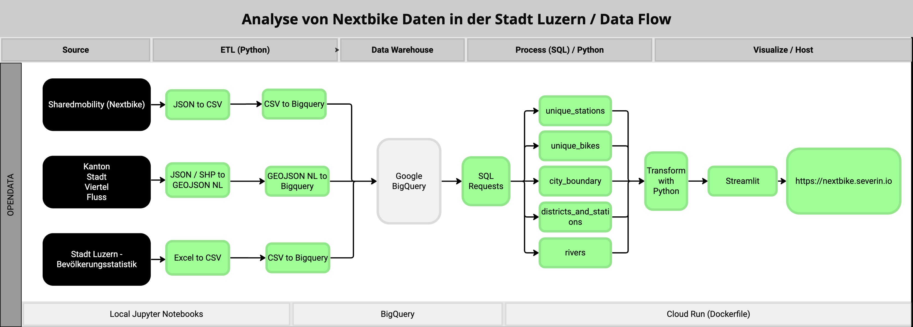
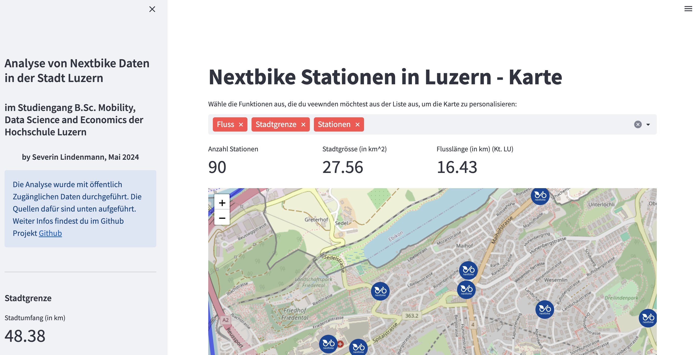

# W.MDSE_VSGIS06.F2481: Nextbike Luzern Analytics Tool

## Disclaimer

Before attempting to run this project, it is crucial to have the Shared Mobility data available. This involves crawling the necessary data and subsequently uploading it into Google BigQuery. The application's functionality heavily relies on accessing this dataset from BigQuery. Failure to properly set up the dataset in BigQuery will result in the inability to run this project effectively. There is no guide for this steps. 

## Overview

This project is a Streamlit-based web application designed for the visual analysis of Nextbike shared mobility data in Luzern. Developed by Severin Lindenmann for the B.Sc. Mobility, Data Science, and Economics program at Hochschule Luzern, it leverages public data to offer insights into the distribution and accessibility of Nextbike stations across the city. Through interactive maps and metrics, users can explore various geographical features such as station locations, district boundaries, river proximity, and more.

### Features

- **Interactive Map Visualization:** Utilize Folium for detailed, interactive maps displaying Nextbike stations, city boundaries, and other geographical elements.
- **Dynamic Data Analysis:** Instantly generate metrics such as the number of stations, district counts, and river lengths within Luzern.
- **User Location Services:** Allow users to find the nearest Nextbike station from their current location.
- **Customization:** Users can select which data layers to display on the map for personalized analysis.
- **Responsive Design:** Optimized for a wide range of devices with an intuitive interface.

## Folder Structure
- W.MDSE_VSGIS06.F2481/: Root directory of the project.
  - data/sharedmobility/: SQL queries for BigQuery.
  - images/: Icons and other media assets.
  - notebook/: Jupyter notebooks for data preprocessing.
  - .gcloudignore: Specifies files to be ignored when deploying to Cloud Run.

- **Additional Files:**
  - `jpg` files for use in markdown files located in the top-level folder.
  - Docker-related files for building and deploying the application.

## Getting Started

### Prerequisites

- Docker
- Google Cloud Platform account and CLI tools
- Google Bigquery
- Data

### Local Testing

To test the application locally, use Streamlit by running:

```bash
streamlit run streamlit.py
```

## Building and Running with Docker

### Build the Docker Image:

```bash
docker build -t gis:latest .
```
### Run the Docker Container:

First, activate your service account with Google Cloud:
gcloud auth activate-service-account

Then, run the Docker container, ensuring you've replaced `service_key.json` with your actual Google Cloud service account key file:
```bash
docker run -v "service_key.json":/gcp/creds.json:ro
--env GOOGLE_APPLICATION_CREDENTIALS=/gcp/creds.json
-p 8080:8080 gis:latest
```

## Cleanup

To free up space after testing or deployment, use:
```bash
docker container prune
docker image prune
docker volume prune
```

## Visuals

### Dataflow Diagram



### Dashboard Example



### Live Demo

A live demo of the application can be found at: [nextbike.severin.io](https://nextbike.severin.io)

## Acknowledgments

- Data Sources: Nextbike, Shared Mobility APIs, Bevölkerung Luzern, OpenStreetMap
- Tools: Streamlit, Folium, Google BigQuery

For further assistance or to report bugs, contact me [Severin](https://severin.io).
